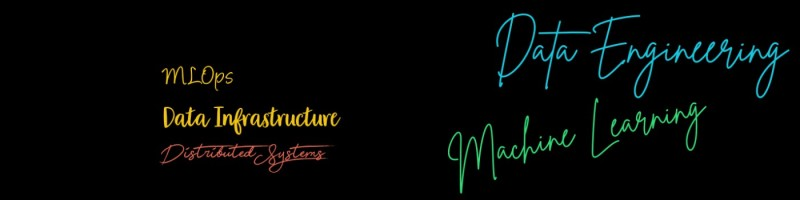

# Around Data Engineering & Machine Learning

*A long, never-ending learning journey*

This repository is a curated collection of notes, papers, blogs, tools, and references around **Data Engineering**, **Distributed Systems**, **Databases**, and **Machine Learning / MLOps**.
The goal is **deep understanding**, not tool hype.

---

## Table of Contents

* [New Tech](#new-tech)
* [Interesting Reads](#interesting-reads)
* [Weekly Digest](#weekly-digest)
* [Data Engineering](#data-engineering)

  * [Level 0](#level-0)
  * [Level 1](#level-1)
  * [Level 1.1](#level-11)
  * [Core Concepts](#data-engineering-core)
* [Infrastructure](#infrastructure)
* [SQL](#sql)
* [NoSQL](#nosql)
* [Machine Learning & MLOps](#machine-learning--mlops)
* [Research Papers](#research-papers)
* [Advanced Topics](#advanced-topics)
* [Discussions & Security](#discussions--security)
* [Basics](#basics)

---

## New Tech

* **DragonflyDB** — High-performance alternative to Redis / Memcached

---

## Interesting Reads

* How to Choose a Distributed Database — GitHub
* Amundsen Review — GitHub
* Deep Dive: FoundationDB — GitHub
* Single-Table Design with DynamoDB — alexdebrie.com
* Managing Apache Spark on Kubernetes — Lightbend
* Git Mistakes Survival Guide — ohshitgit.com
* Practical Use Cases of Change Data Capture — Medium
* Apache Iceberg Resources — GitHub
* Riak Database Overview — GitHub

---

## Weekly Digest

* Why Data Engineering Gets Complicated Over Time
* What is eBPF
* SSTables & LSM Trees — Absolute Basics

---

## Data Engineering

### Level 0

* Getting Started with Data Engineering (Volumes 1–6)
* Apache Airflow Fundamentals
* Dagster Overview
* dbt (Data Build Tool)
* Apache Superset
* Apache Hop
* Apache Iceberg (Partitioning, Evolution)
* Trino vs Spark SQL
* Apache Spark Internals
* Apache Hudi Basics
* OpenTelemetry
* PySpark Pandas UDFs
* Cost Optimization for Data Engineers
* PyFlink
* Delta Lake Cheat Sheet
* Parquet File Format
* SQL Anti-Patterns
* Apache Kafka (Conceptual)
* ETL Fundamentals
* Proxy vs Reverse Proxy

---

### Level 1

* Data Quality Fundamentals
* Cloud Skills for Data Engineers
* Kubernetes Fundamentals
* Kafka Internals & Guarantees
* CDC with Debezium
* Apache Pinot
* Redpanda
* Iceberg & Hudi Internals
* ZooKeeper Concepts
* Event-Driven Architectures
* Data Discovery & Metadata

---

### Level 1.1

* VM vs Containers
* Dagster vs Airflow
* Single Source of Truth
* CDC for Distributed Databases
* Metadata Platforms (OpenMetadata, Amundsen)
* Lakehouse Architecture
* etcd
* Redis Internals
* Hive Basics
* Data Warehouse Design
* Relational Data Models

---

## Data Engineering Core

* Data Engineering Roles & Boundaries
* Spark Internals & Performance
* Apache Beam
* Exactly-Once Semantics
* Distributed System Failures
* High Availability Design
* Logs as a Fundamental Abstraction
* Data Pipelines Design
* Data Lineage & Metadata
* Performance Metrics for Data Systems
* Storage Internals
* Protocol Buffers
* WAL & Transaction Logs

---

## Infrastructure

* Databases on Kubernetes
* Kubernetes Architecture & APIs
* Operators Pattern
* Docker Security
* Kafka Infrastructure Design
* Observability & Monitoring
* Load Balancers
* Serverless Computing
* Disaster Recovery
* Kubernetes Networking
* Kubernetes Debugging & Best Practices

---

## SQL

* SQL Fundamentals → Advanced SQL
* Query Optimization
* Indexing & Partitioning
* Execution Plans
* Transactions & ACID
* OLAP vs OLTP
* Distributed SQL (Trino / Presto)
* Sharding & Replication
* Materialized Views
* Concurrency Control
* Stored Procedures & Triggers

---

## NoSQL

* NoSQL Fundamentals
* MongoDB
* CouchDB
* DynamoDB
* Key-Value Stores
* Consistency Models

---

## Machine Learning & MLOps

### MLOps

* End-to-End ML Workflow
* Feature Stores
* Model Deployment
* ML Versioning
* Explainable AI
* ML Monitoring
* ML Infrastructure Design

### Projects

* Streamlit ML Applications
* Distributed ML with Ray
* Bioinformatics Tooling
* Adversarial ML Security

---

## Research Papers

### Distributed Systems

* Google File System
* Bigtable
* Dynamo
* Kafka Paper
* Snowflake Architecture
* Delta Lake
* Presto / Trino
* Paxos vs Raft
* Consistent Hashing
* Serverless Computing
* Distributed Tracing (Dapper)

---

## Advanced Topics

* Query Engines (Volcano Model)
* Vectorization vs Compilation
* Storage Engines
* Memory Management
* Serverless Databases
* Blockchain & Distributed Systems
* Database Operating Systems (DBOS)
* Lineage Tracking
* AI for Databases

---

## Discussions & Security

* Managed vs Self-Managed Infrastructure
* Threat Modeling (OWASP)
* Kubernetes Security
* Secrets Management
* ML Product Development Approaches

---

## Basics

* Compilers
* Raft Consensus
* SSH Internals
* Virtual Memory
* Operating System Fundamentals

---

## Philosophy

> Data Engineering is not about tools.
> It is about **correctness, scalability, reliability, and cost**.
